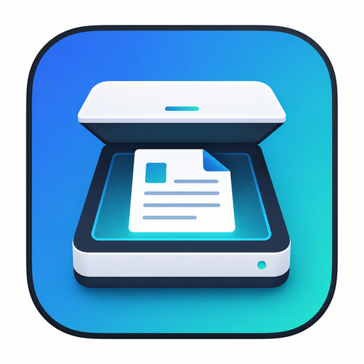

# ScanDesk

A clean, modern desktop scanner app for Linux. Plug in your scanner, scan pages to PDF or PNG, preview them in a live thumbnail sidebar, and email them straight from the app.



---

## Features

- **One-click scanning** — Detects any SANE-compatible scanner (USB or networked)
- **PDF & PNG output** — Choose format per-scan, with selectable DPI (150 / 300 / 600)
- **Live preview sidebar** — Thumbnails of every scan in the current session
- **Session folders** — Organise scans by project or date
- **Built-in email** — Open Gmail compose with your scans attached, or draft via your default mail client
- **Light & dark themes** — Switch instantly; preference is remembered
- **Auto-save settings** — Scanner, resolution, folder, and email defaults persist between sessions

---

## Requirements

- Linux (Debian/Ubuntu, Fedora, Arch, or derivatives)
- Python 3.9 or newer
- A SANE-compatible scanner (most Canon, Epson, HP, Brother models)

### System packages needed

| Distro | Command |
|--------|---------|
| Debian / Ubuntu | `sudo apt-get install python3 python3-pip python3-tk sane-utils img2pdf` |
| Fedora | `sudo dnf install python3 python3-pip python3-tkinter sane-backends img2pdf` |
| Arch | `sudo pacman -S python python-pip tk sane img2pdf` |

---

## Quick Start

### Option A — One-line install (recommended)

```bash
cd scandesk/
sudo bash install.sh
```

Then launch:

```bash
scandesk          # from terminal
# or search "ScanDesk" in your applications menu
```

### Option B — Run without installing

```bash
cd scandesk/
pip3 install -r requirements.txt
./run-scandesk.sh
```

---

## Packaging

Build a pip-installable wheel:

```bash
pip3 install build
python3 -m build --wheel
```

Build a release tarball for direct distribution:

```bash
tar czvf scandesk-v1.0.0-linux.tar.gz \
  scandesk.py run-scandesk.sh install.sh uninstall.sh \
  scandesk.desktop requirements.txt LICENSE README.md assets/
```

---

## Uninstall

```bash
sudo bash uninstall.sh
```

Removes `/opt/scandesk`, the desktop entry, and the `scandesk` command.

---

## Support

- GitHub Issues: https://github.com/mrmoe28/scandesk/issues
- Email: edward@ekosolarllc.com

---

## License

MIT License — see [LICENSE](LICENSE) for full text.

Copyright (c) 2026 EKO Solar LLC
